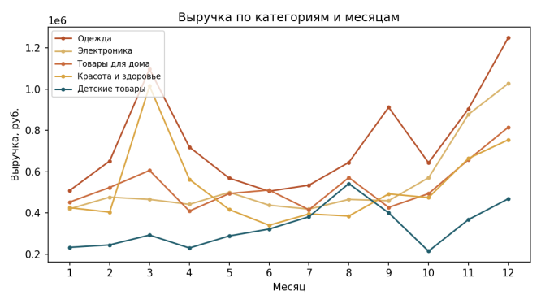
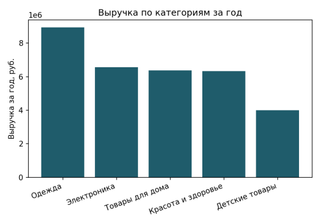

# Анализ сезонности продаж

Продуктовая аналитика: анализ сезонности выручки условного продавца
на маркетплейсе за 2024 год, с рекомендацией по планированию закупок.

## Задача

Данные о продажах за год по 5 категориям товаров. Нужно понять,
когда у каждой категории наступает сезонный пик, чтобы дать
рекомендацию по объёму и срокам закупок.

## Файлы в репозитории

| Файл | Содержание |
|---|---|
| `analysis.sql` | Полный SQL-скрипт: создание таблиц, разведочный анализ, поиск и устранение некорректных записей, агрегация по месяцам и категориям (PostgreSQL) |
| `monthly_category_sales.csv` | Результат SQL-агрегации – выручка и количество проданных единиц по месяцам и категориям, источник данных для дашборда |
| `sales_seasonality_dashboard.pbix` | Интерактивный дашборд (Power BI) |
| `raw-data/sales.csv` | Исходные (сырые) данные о продажах – содержат пропуски, аномалии, дубликаты |
| `raw-data/products.csv` | Исходный справочник товаров |

## Данные и очистка

Исходные данные: 14 130 попыток заказов за 2024 год по 26 товарам в
5 категориях (Одежда, Электроника, Товары для дома, Детские товары,
Красота и здоровье), а также справочник товаров. В ходе разведочного
анализа обнаружено 6 типов некорректных записей, исключённых перед
расчётом метрик:

- Пропущенный `product_id` – невозможно определить категорию товара
- Отрицательное количество товара в заказе
- Нулевая цена товара
- Пропущенный регион – включая случаи, где пропуск был записан как
  пустая строка, а не как NULL, и не обнаруживался стандартной проверкой
- Дата заказа за пределами периода теста (2024 год)
- Полные дубликаты строк (задвоенные заказы)

Очистка выполнена средствами SQL (PostgreSQL): создание таблиц,
загрузка данных, отдельные запросы на каждый тип аномалии, финальная
выгрузка чистой и агрегированной таблицы (сумма выручки и количество
проданных единиц по месяцам и категориям). Из анализа также исключены
заказы со статусом «Возврат» и «Отменён» – в закупочное планирование
должны попадать только состоявшиеся продажи.

## Результаты: сезонность по категориям

Общая выручка за 2024 год – 32,2 млн руб., продано 13 706 единиц
товара. Лидер по годовой выручке – категория «Одежда» (8,9 млн руб.),
далее «Электроника» (6,6 млн), «Товары для дома» (6,4 млн), «Красота
и здоровье» (6,3 млн) и «Детские товары» (4,0 млн).

При этом общая годовая сумма скрывает разную динамику по месяцам:

- **Красота и здоровье** – резкий, изолированный пик в марте (около
  1 млн руб. за месяц) – совпадает с сезоном подарков к 8 марта, в
  остальные месяцы спрос заметно ниже
- **Одежда** – двойной пик: в марте и нарастающий рост к концу года
  (ноябрь–декабрь)
- **Электроника** – устойчивый рост к концу года с максимумом в
  ноябре–декабре (сезон 11.11, Чёрная пятница, Новый год)
- **Детские товары** – самая ровная динамика, без ярко выраженного
  пика, с небольшим ростом во второй половине года

## Рекомендация для закупок

Итоговая сумма выручки за год не отражает реальной картины спроса –
три из пяти категорий имеют выраженные сезонные пики, требующие
заблаговременного планирования складских остатков, а не равномерного
распределения закупок по месяцам.

**Рекомендация:** увеличивать закупки по категории «Красота и
здоровье» за 3–4 недели до марта; по «Электронике» – начиная с
октября, к пику 11.11 и Нового года; по «Одежде» – планировать
закупки двумя волнами (весна и конец года) отдельно. Для «Товаров
для дома» и «Детских товаров» с более ровным спросом равномерное
пополнение остатков остаётся оправданным.

**Ограничение анализа:** данные охватывают только один год –
сезонные паттерны стоит подтвердить на данных за 2–3 года, прежде
чем закладывать их в постоянный план закупок, поскольку однолетний
ряд не позволяет отличить устойчивую сезонность от случайных
колебаний конкретного года.

## Стек

PostgreSQL, SQL, Power BI
